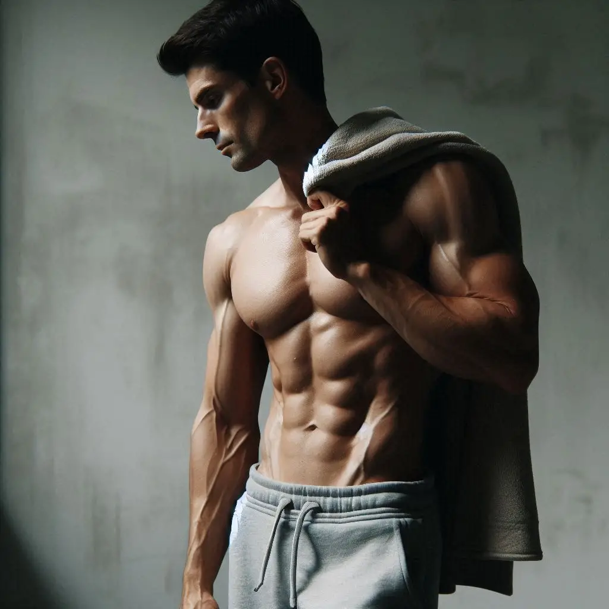

O Paradoxo "Natty": A Fotografia de Estúdio que a IA Não Consegue Distinguir 💪✨

## 📒 Descrição
Este projeto faz parte do Lab DIO "Natty or Not" e teve como objetivo explorar os limites do fotorrealismo em IAs Generativas, especificamente na criação de uma imagem que representasse um físico atlético altamente definido, mas 100% natural e autêntico ("Natty").

O desafio foi evitar o visual exagerado, brilhante e artificial que é frequentemente o output padrão desses modelos, forçando a IA a focar na sutileza da iluminação e na textura natural da pele.

## 🤖 Tecnologias Utilizadas
IA Generativa: Bing Image Creator (DALL-E 3)

Modelo Base/Estilo: DALL-E 3 (Integrado ao Bing Creator)

Ferramentas de Suporte: Não foi necessário o uso de ferramentas adicionais de edição, focando 100% no Prompt Engineering.

## 🧐 Processo de Criação
Para alcançar a estética "Natty", adotei uma estratégia de Prompt Engineering Inversivo, concentrando-me tanto no que a imagem deveria ser quanto no que ela não deveria ser.
Prompt de Criação {
    Fotografia documental de um atleta masculino na casa dos 30 anos, com um físico magro e tonificado, em uma academia com pouca luz natural. Ele está em uma pose relaxada, com uma toalha no ombro. Foto tirada com lente de 50mm, profundidade de campo rasa, granulação sutil de filme, cores neutras e suaves. Sem brilho na pele, sem veias exageradas, sem Photoshop.
}

## 🚀 Resultados
Apresente os resultados do seu projeto

## 💭 Reflexão (Opcional)
O paradoxo deste desafio é que precisamos ser mais descritivos sobre o natural para que a IA possa simular a imperfeição da realidade. O sucesso foi alcançado ao forçar o modelo a pensar como um fotógrafo, e não como um designer 3D.
```

